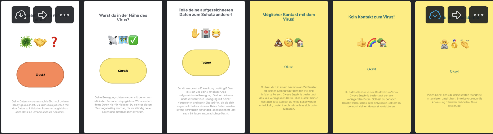

## Coronicle Frontend

Coronicle is an app which allows users to first locally track their geo position. Once they are infected they can upload their traces to this backend. This allows all users to query with their own traces if they have been in close contact to someone infected.

It a standard react native app built using the Expo framework.

Backend: [Found here](https://github.com/Coronicle/coronicle-be)

